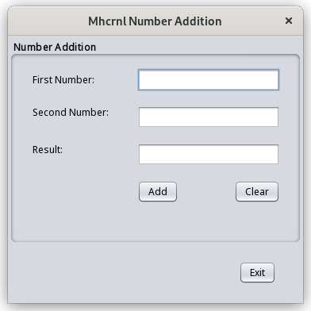

## Calculator pentru adunarea a doua numere



### Run program

1. NetBeans 15
2. java /src/main/java/com/mhcrnl/numberaddition03/NumberAdditionUI.java
3. In folder target run: 

```	
$ java -cp  NumberAddition03-1.0-SNAPSHOT.jar com.mhcrnl.numberaddition03.NumberAdditionUI
```
4. In folder target run:

```
$ ./run.sh
```